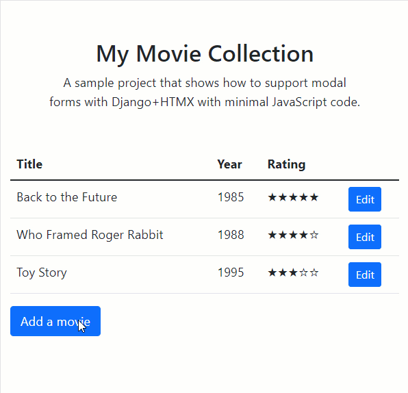

# Django+HTMX modal form

This project demonstrates how to show a Django Form in a modal dialog box using HTMX.



This branch contains the **Bootstrap 5** version.  
See also the [Bootstrap 4 version](https://github.com/bblanchon/django-htmx-modal-form/tree/bootstrap4) in this repository, or a [Tailwind + Alpine.js version](https://github.com/geoffbeier/django-htmx-modal-form) in @geoffbeier's fork.

There are two additionnal branches that show how to use this technique with the Django messages framework: [with the `HX-Trigger` technique](https://github.com/bblanchon/django-htmx-modal-form/tree/messages-framework) and [with the "OOB swap" technique](https://github.com/bblanchon/django-htmx-modal-form/tree/messages-framework-oob)

Learn more about this technique here:

* [Modal forms with Django+HTMX](https://blog.benoitblanchon.fr/django-htmx-modal-form/) (blog post)
* [Modal forms with Django+HTMX](https://youtu.be/3dyQigrEj8A) (YouTube video)
* [Toasts with Django+HTMX](https://blog.benoitblanchon.fr/django-htmx-toasts/) (blog post)
* [Toasts with Django+HTMX](https://youtu.be/pAtrj8A-Kl4) (YouTube video)
* [Using the Django messages framework with HTMX](https://blog.benoitblanchon.fr/django-htmx-messages-framework/) (blog post)
* [Django+HTMX: integration with the messages framework](https://youtu.be/I5_g7XYyemQ) (YouTube video)
* [Django+HTMX: integration with the messages framework](https://github.com/bblanchon/django-htmx-messages-framework/) (GitHub repository)

To run the demo locally:

```
pipenv install
pipenv run migrate
pipenv run server
```